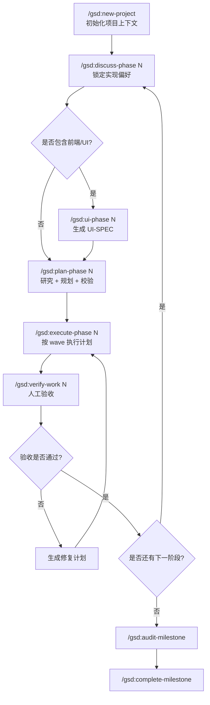
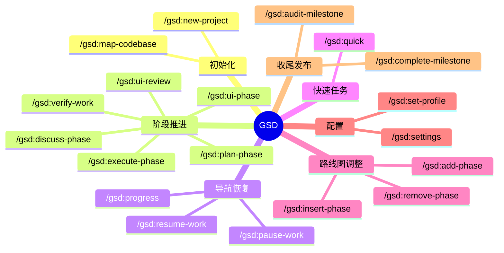

[GSD](https://github.com/gsd-build/get-shit-done) 不是脚手架，而是一套给 AI 编程工具用的规格驱动工作流。它的目标很明确：把长任务拆成多个短上下文，降低 context rot，让规划、执行、验证都可追踪。

## GSD 解决什么问题

典型 AI 编程失效路径是：

- 一个会话里同时做需求澄清、方案设计、编码、验收
- 上下文越滚越大，后半段质量下降
- 计划过大，执行不可验证
- 写完代码，但没有可靠验收闭环

GSD 的做法是把流程拆成阶段，并把状态落盘到 `.planning/`。核心文件包括：

- `PROJECT.md`
- `REQUIREMENTS.md`
- `ROADMAP.md`
- `STATE.md`
- `config.json`
- `phases/`

适合需要跨会话推进、分阶段交付、保留验收记录的项目。

## 支持的运行时

- Claude Code
- Codex
- Gemini CLI
- OpenCode

命令前缀不同：

- Claude Code / Gemini: `/gsd:help`
- OpenCode: `/gsd-help`
- Codex: `$gsd-help`

## 安装

最简单的方式：

```bash
npx get-shit-done-cc@latest
```

非交互安装：

```bash
npx get-shit-done-cc --claude --global
npx get-shit-done-cc --codex --global
npx get-shit-done-cc --gemini --global
npx get-shit-done-cc --opencode --global
```

只装当前项目，把 `--global` 换成 `--local`。

安装完成后验证：

```bash
# Claude Code / Gemini
/gsd:help

# OpenCode
/gsd-help

# Codex
$gsd-help
```

## 标准工作流

完整链路如下：

```bash
/gsd:new-project
/clear
/gsd:discuss-phase 1
/gsd:ui-phase 1
/gsd:plan-phase 1
/gsd:execute-phase 1
/gsd:verify-work 1
/gsd:ui-review 1
```

非前端阶段可跳过 `ui-phase` 和 `ui-review`。

### 工作流流程图



### 核心命令表

| 命令 | 作用 | 何时使用 | 主要产物 |
| --- | --- | --- | --- |
| `/gsd:new-project` | 初始化项目上下文、需求和路线图 | 新项目开始时 | `PROJECT.md`、`REQUIREMENTS.md`、`ROADMAP.md`、`STATE.md` |
| `/gsd:new-project --auto @prd.md` | 从现有文档自动初始化 | 已有 PRD 或需求文档时 | 同上 |
| `/gsd:discuss-phase N` | 锁定当前阶段的实现偏好 | 规划前 | `CONTEXT.md` |
| `/gsd:ui-phase N` | 为前端阶段生成设计约束 | `discuss-phase` 之后、`plan-phase` 之前 | `UI-SPEC.md` |
| `/gsd:plan-phase N` | 研究当前阶段并拆出可执行计划 | 执行前 | `RESEARCH.md`、`PLAN.md`、`VALIDATION.md` |
| `/gsd:execute-phase N` | 按依赖关系执行全部计划 | 计划确认后 | `SUMMARY.md`、`VERIFICATION.md`、原子提交 |
| `/gsd:verify-work N` | 人工验收并生成修复闭环 | 执行完成后 | `UAT.md`、修复计划 |
| `/gsd:ui-review N` | 对已实现 UI 做视觉审查 | 前端阶段验收后 | `UI-REVIEW.md` |

### 补充命令表

| 命令 | 作用 | 适用场景 |
| --- | --- | --- |
| `/gsd:map-codebase` | 分析已有代码库结构和约定 | 老项目、接手项目、重构前 |
| `/gsd:quick` | 用短流程处理单次任务 | 小功能、修 bug、配置修改 |
| `/gsd:progress` | 查看当前阶段和下一步 | 会话中途、恢复工作前 |
| `/gsd:resume-work` | 恢复上一次工作上下文 | 换会话继续开发 |
| `/gsd:pause-work` | 生成交接上下文 | 中途暂停时 |
| `/gsd:settings` | 修改 workflow 和模型配置 | 调整成本、质量、自动化强度 |
| `/gsd:set-profile <profile>` | 切换模型策略 | 在 `quality / balanced / budget` 间切换 |
| `/gsd:add-phase` | 在路线图末尾追加阶段 | 新增范围时 |
| `/gsd:insert-phase N` | 在中间插入紧急阶段 | 中途插单时 |
| `/gsd:remove-phase N` | 删除未来阶段并重排编号 | 砍需求时 |
| `/gsd:audit-milestone` | 检查里程碑是否达成完成定义 | 发布前 |
| `/gsd:complete-milestone` | 归档里程碑并打 tag | 里程碑收尾时 |

### 阶段职责表

| 阶段 | 输入重点 | 输出重点 | 风险点 |
| --- | --- | --- | --- |
| `new-project` | 项目目标、范围、技术栈 | 项目上下文和路线图 | 需求边界不清 |
| `discuss-phase` | 设计偏好、实现边界、非目标 | `CONTEXT.md` | 跳过后会出现默认假设 |
| `plan-phase` | 当前阶段目标、上下文、研究结果 | 原子化计划文件 | phase 过大导致计划失真 |
| `execute-phase` | 已确认的 plan | 代码、提交、总结 | plan 粒度过大或依赖关系混乱 |
| `verify-work` | 阶段交付结果 | `UAT.md`、修复计划 | 只看测试不做人工验收 |

## Demo 1：新建 Todo Web App

目标：

- Next.js + TypeScript + SQLite
- 单用户
- 支持新增、完成、删除

执行顺序：

```bash
/gsd:new-project
/gsd:discuss-phase 1
/gsd:ui-phase 1
/gsd:plan-phase 1
/gsd:execute-phase 1
/gsd:verify-work 1
```

`new-project` 输入示例：

```text
做一个 Todo Web App。
技术栈是 Next.js + TypeScript + SQLite。
第一版不做登录，只做单用户。
目标是完成增删改查闭环，移动端可用。
```

`discuss-phase 1` 输入示例：

```text
页面保持高信息密度，不做营销风格设计。
列表项支持快速完成和删除。
空状态必须给明确操作提示。
移动端点击区域要足够大。
```

`plan-phase 1` 之后检查：

- 每个 plan 范围足够小
- 每个 plan 都有明确 verify 步骤

`verify-work 1` 检查项：

1. 新建待办是否成功
2. 状态切换是否即时生效
3. 删除是否可恢复或至少行为一致
4. 刷新后数据是否存在
5. 移动端交互是否误触

## Demo 2：在现有项目中追加功能

```bash
/gsd:map-codebase
/gsd:new-project
/gsd:discuss-phase 1
/gsd:plan-phase 1
/gsd:execute-phase 1
/gsd:verify-work 1
```

`map-codebase` 会生成：

- `STACK.md`
- `ARCHITECTURE.md`
- `STRUCTURE.md`
- `CONVENTIONS.md`
- `TESTING.md`
- `INTEGRATIONS.md`
- `CONCERNS.md`

后续规划会直接基于现有结构。

小需求可直接用：

```bash
/gsd:quick
```

例如：

```text
为博客新增文章搜索页，支持标题和摘要匹配，保持现有站点风格。
```

适用场景：

- 小功能
- bug 修复
- 配置改动
- 一次性维护任务

## 最值得先掌握的命令

- `/gsd:help`
- `/gsd:new-project`
- `/gsd:discuss-phase`
- `/gsd:plan-phase`
- `/gsd:execute-phase`
- `/gsd:verify-work`
- `/gsd:map-codebase`
- `/gsd:quick`

### 命令体系思维导图



## 配置建议

配置文件是 `.planning/config.json`。

### `mode`

- `interactive`: 默认，适合大多数项目
- `yolo`: 自动化更强，适合熟练用户

### `granularity`

- `coarse`
- `standard`
- `fine`

阶段越复杂，越适合 `fine`。

### `model_profile`

- `quality`
- `balanced`
- `budget`
- `inherit`

建议：

- 原型期：`budget`
- 常规开发：`balanced`
- 关键阶段：`quality`

### workflow 开关

- `workflow.research`
- `workflow.plan_check`
- `workflow.verifier`
- `workflow.nyquist_validation`
- `workflow.ui_phase`
- `workflow.ui_safety_gate`

不熟悉领域时，建议保持默认；只做快速原型时再酌情关闭。

## 典型误区

### 跳过 `discuss-phase`

常见结果不是功能错误，而是实现风格偏离预期。AI 会用默认判断填满灰区。

### phase 切太大

如果一个阶段同时覆盖数据库、API、前端、权限、测试、部署，plan 往往会失真。GSD 不是拿来吞掉模糊范围的。

### 不做 `verify-work`

测试通过不等于功能完成。尤其是交互、空状态、错误流程、移动端兼容这类问题，必须人工验收。

### 老项目不跑 `map-codebase`

这会增加“风格不一致”和“破坏现有结构”的概率。

## 结论

GSD 的价值在于把 AI 编程从单轮 prompt 提升为阶段化工作流，更适合多阶段任务和持续交付。

如果你的项目已经开始出现需求拆分、阶段推进、跨会话恢复、验收闭环这些问题，GSD 值得直接上手。
