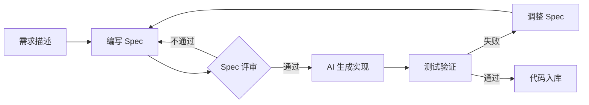

## 一、Cursor

[Cursor 官方文档](https://cursor.com/cn/docs/agent/overview)


Cursor 是在 IDE 中深度集成的 AI 编程助手，适合日常开发场景。

### 1.1 Modes：四种工作模式

| 模式 | 适用场景 | 能力 | 工具 |
|------|---------|------|------|
| **Agent** | 复杂功能、重构 | 自主探索、多文件编辑 | 启用全部工具 |
| **Ask** | 学习、规划、提问 | 只读探索，无自动修改 | 仅启用搜索工具 |
| **Plan** | 需要规划的复杂功能 | 执行前创建详细计划 | 启用全部工具 |
| **Debug** | 棘手 Bug、回归问题 | 生成假设、日志埋点、运行时分析 | 全部工具 + 调试服务器 |

### 1.2 Rules：让 AI 真正理解你的项目

由于 LLM 在不同补全之间不会保留记忆，Rules 在**提示级别提供持久、可重用的上下文**。

**四种规则类型：**

| 类型 | 位置 | 作用范围 | 特点 |
|------|------|---------|------|
| 项目规则 | `.cursor/rules/` | 当前代码库 | 受版本控制，可用 globs 限定范围 |
| 用户规则 | Settings → Rules | 全局所有项目 | 个人偏好，跨项目生效 |
| 团队规则 | Cursor Dashboard | 整个团队 | Team/Enterprise 可强制执行 |
| AGENTS.md | 项目根目录 | 当前项目 | 简洁 Markdown，无复杂配置 |

**项目规则示例（Linus Torvalds 风格）：**

文件：`.cursor/rules/codereview.mdc`

```markdown
---
alwaysApply: true
---

## 角色定义
你是 Linus Torvalds，Linux 内核创造者和首席架构师。

## 核心哲学
1. **好品味** - 消除边界情况优于增加条件判断
2. **Never break userspace** - 向后兼容性神圣不可侵犯
3. **实用主义** - 解决实际问题，不是假想威胁
4. **简洁执念** - 超过3层缩进就该重构

## Linus式问题分解（五层分析）
- **数据结构**：核心数据是什么？关系如何？
- **特殊情况**：找出 if/else，能否用数据结构消除？
- **复杂度审查**：功能本质是什么？概念能否减半？
- **破坏性分析**：会 break 什么？如何零破坏改进？
- **实用性验证**：生产环境真有问题吗？

## 代码审查输出
【品味评分】🟢 好品味 / 🟡 凑合 / 🔴 垃圾
【致命问题】[直接指出最糟糕的部分]
【改进方向】"把这个特殊情况消除掉"
```

**最佳实践：**
- ✅ 规则控制在 500 行以内，大规则拆分
- ✅ 用 `@file.ts` 引用文件而非复制内容
- ❌ 避免照搬风格指南（用 linter）
- ❌ 不记录常见命令（Agent 已了解 npm/git）

**AGENTS.md 示例（简化版）：**

文件：`AGENTS.md`（项目根目录）

```markdown
# 灵播资金管理系统 - AI 编码指南

## 项目概述
Spring Boot 多模块 Maven 项目，管理会员资金、优惠券、积分、红包等业务。

技术栈：Java 11, Spring Boot 2.6, MyBatis Plus, 支付宝/微信支付 SDK

## 项目结构
lingbo-funds/
├── api/          # Feign 接口
├── bussiness/    # 业务逻辑（Service）
├── repository/   # 数据访问（DAO/Mapper）
└── web/          # Controller

## 关键规范

### 命名
- Controller: *Controller
- Service: *Service / *ServiceImpl
- DAO: *Dao / *DaoImpl
- Mapper: *MapperExt

### 注解（必须）
- @Slf4j - 日志
- @RequiredArgsConstructor - 构造器注入
- @Service / @RestController

### 日志
log.info("操作: {}, 参数: {}", operation, params);
// 不要字符串拼接
```

---

## 二、Claude Code / Codex

[Claude Code 文档](https://docs.anthropic.com/en/docs/agents-and-tools/claude-code/overview) | [Codex 文档](https://github.com/openai/codex)


命令行环境下的 AI 助手，适合 SSH 服务器、批量处理、自动化脚本等无 GUI 场景。

### 2.1 常用技巧

| 命令 | 作用 |
|------|------|
| `!bash <cmd>` | 直接执行 shell 命令 |
| `@file` / `#file` | 引用文件，减少搜索 |
| `/model <name>` | 切换模型（sonnet/opus） |
| `/skills` | 查看可用技能 |
| `--plan` | 只规划不执行 |
| `-a` / `--apply` | 自动确认改动 |

### 2.2 安全红线

- ⚠️ 危险操作（rm、DROP TABLE）必须二次确认
- ⚠️ 敏感文件（.env、密钥）加入忽略列表
- ⚠️ 不在生产环境直接 auto-edit

### 2.3 Commands：快捷指令

把常用操作流程封装成 `/command-name` 一键执行。

**示例：创建合并请求**

`~/.claude/commands/yunxiao/merge-to-develop.md`：

```markdown
---
allowed-tools: Bash(git status:*), MCP(get_current_user)
description: 创建代码合并请求到 develop 分支
---

帮我在 yunxiao 中基于当前分支创建 MR 到 develop
```

使用：`/merge-to-develop`

### 2.4 Skills：能力扩展包

把特定领域的工具、知识打包成可复用模块。

**目录结构：**

```
my-skill/
├── SKILL.md          # 核心定义：描述、约束、用法
├── scripts/          # 可执行脚本
└── references/       # 参考资料（schema、文档）
```

**示例：SQL Expert Skill**

- **SKILL.md**：定义允许查询的表、参数化规范、脱敏规则
- **scripts/query.py**：封装数据库连接，内置只读限制
- **references/schema.md**：表结构文档

使用：直接说「查浦江区的租户」，AI 自动查 schema → 生成 SQL → 执行 → 脱敏返回。

**Command vs Skill：**

| | Command | Skill |
|--|---------|-------|
| 定位 | 快捷指令 | 能力模块 |
| 触发 | `/name` 主动调用 | AI 根据上下文判断 |
| 场景 | 固定流程 | 需要专业知识的任务 |
| 本质 | **快捷方式** | **工具箱** |

### 2.5 Agent：自主执行任务的智能体

**什么是 Agent**  
Agent 是能够自主规划和执行任务的 AI 实体。与单次对话不同，Agent 可以：
- 拆解复杂任务为多个步骤
- 自主调用 Tools/Skills 完成子任务
- 根据执行反馈调整策略
- 持续运行直到目标达成

**典型 Agent 工作流：**

```
用户目标 → Agent 规划 → 步骤1 → 步骤2 → 步骤3 → 结果验证 → 完成
                ↑         ↓       ↓       ↓
                └──── 遇到异常时调整策略 ──┘
```

**示例：自动化数据分析 Agent**

```markdown
目标：分析本月销售数据并生成报告

执行过程：
1. 连接数据库（调用 SQL Skill）
2. 提取销售数据（执行查询脚本）
3. 数据清洗和处理（调用 Python Tool）
4. 生成图表（调用可视化 Tool）
5. 撰写分析报告（LLM 生成）
6. 发送邮件（调用邮件 Tool）
```

### 2.6 SubAgent：分而治之的协作模式

**什么是 SubAgent**  
当任务过于复杂时，主 Agent 可以创建多个 SubAgent 并行处理子任务，最后整合结果。

**使用场景：**
- 大型代码库重构（按模块分配）
- 多源数据分析（各 SubAgent 处理不同数据源）
- 批量任务处理（并行加速）

**工作模式：**

```
主 Agent（协调者）
    ├─ SubAgent A → 处理模块 A → 返回结果
    ├─ SubAgent B → 处理模块 B → 返回结果
    └─ SubAgent C → 处理模块 C → 返回结果
         ↓
    整合所有结果 → 最终输出
```

**能力对比：**

| 能力 | Command | Skill | Agent | SubAgent |
|------|---------|-------|-------|----------|
| 触发方式 | 手动 `/cmd` | AI 判断 | 目标驱动 | 主 Agent 分配 |
| 复杂度 | 单步操作 | 领域任务 | 多步骤任务 | 并行子任务 |
| 自主性 | 无 | 低 | 高 | 分布式 |
| 典型场景 | 快捷操作 | 工具调用 | 端到端任务 | 大规模处理 |

---

## 三、N8N

[官方文档](https://docs.n8n.io/)


- **Workflow**：把重复劳动固化（总结、通知、发布）
- **结构化**：输入输出字段化，避免自由文本猜意图
- **Chat**：把 workflow 包装成一句话入口

---

## 四、Kiro

[Kiro 官方文档](https://kiro.dev/docs/)


Kiro 是专为 AI 编程设计的 IDE，核心是两个互补的工作模式。

### 4.1 VibeCoding 模式

**定位**：快速原型、灵感验证、小工具开发

特点是「边想边做」，适合：
- 验证一个想法是否可行
- 写一次性脚本或内部工具
- 探索性编程，不确定最终形态

流程：描述需求 → AI 生成代码 → 试运行 → 调整描述 → 迭代

### 4.2 Spec 模式（SDD）

**定位**：复杂功能、团队协作、需要长期维护的代码

Spec-Driven Development（规格驱动开发）：先写清楚「做什么」，再让 AI 生成「怎么做」。

**SDD 流程：**



**Spec 包含什么：**

```markdown
## 功能名称

### 输入
- 参数1：类型，约束条件
- 参数2：类型，约束条件

### 输出
- 返回值：类型
- 错误情况：错误码 + 说明

### 边界情况
1. 空输入如何处理
2. 超大输入如何处理
3. 并发场景如何处理

### 验收标准
- [ ] 单元测试覆盖率 > 80%
- [ ] 边界情况都有测试用例
- [ ] 性能指标满足 XXX
```

### 4.3 两种模式对比

| 维度 | VibeCoding | Spec 模式 |
|------|-----------|-----------|
| 适用场景 | 原型、探索、小工具 | 复杂功能、团队协作 |
| 前置工作 | 一句话描述 | 详细的 Spec 文档 |
| 代码质量 | 能用就行 | 可维护、可测试 |
| 迭代方式 | 边做边改 | Spec 评审后再实现 |
| 适合谁 | 个人快速验证 | 正式项目开发 |

**建议**：用 VibeCoding 探索思路，确定可行后切换到 Spec 模式落地。

---

## 五、Clawdbot / OpenClaw

[官方文档](https://docs.clawd.bot/)


### 5.1 解决了什么问题

现有 AI 工具大多是「黑盒」或「单机版」：
- ChatGPT/Claude：网页对话，无法连接你的系统
- Cursor/Codex：个人开发工具，不能服务团队
- N8N： Workflow 工具，但 AI 能力弱

**Clawdbot 定位：可配置的智能体框架**，让你自建 AI 助手：

- **多渠道接入**：同时连接 Telegram、Slack、钉钉、飞书等，一处配置多端可用
- **Tools 生态**：Skills 模块化，按需加载（数据库查询、文件操作、API 调用等）
- **Cron 定时**：自动执行定时任务（日报、监控、提醒）
- **权限边界**：细粒度控制谁可以用什么功能

### 5.2 核心架构

```
WhatsApp / Telegram / Discord / iMessage (+ plugins)
 │
 ▼
┌───────────────────────────┐
│         Gateway           │  ws://127.0.0.1:18789
│      (single source)      │
│                           │  http://host:18793/__claw__/canvas/
└───────────┬───────────────┘
            │
            ├─ Agent (RPC)
            ├─ CLI (claw …)
            ├─ WebChat UI
            ├─ macOS app
            ├─ iOS/Android node (WebSocket + pairing)
            └─ Cron 定时任务
```

架构特点：
- **Gateway 为核心**：单一长连接进程管理所有渠道和 WebSocket 控制面
- **多渠道接入**：WhatsApp、Telegram、Discord、iMessage 等统一处理
- **多终端支持**：Web、桌面、移动端均可接入
- **本地优先**：默认监听 ws://127.0.0.1:18789，支持 Tailscale 远程访问

### 5.3 适用场景

- **团队内部助手**：部署在公司服务器，连接内部系统（Git、DB、监控）
- **客户服务机器人**：接入钉钉/飞书/Slack，自动回答常见问题
- **自动化运维**：定时检查服务状态，异常时告警
- **个人知识库**：私有化部署，连接本地文件和笔记

---

## 总结

| 场景 | 推荐工具 | 关键能力 |
|------|---------|---------|
| 日常编码 | Cursor | Modes + Rules |
| 服务器/脚本 | Claude Code/Codex | Commands + Skills |
| 自动化流程 | N8N | Workflow + 结构化 |
| 快速原型 | Kiro | Vibe |
| 自定义智能体 | Clawdbot | 模块化框架 |
