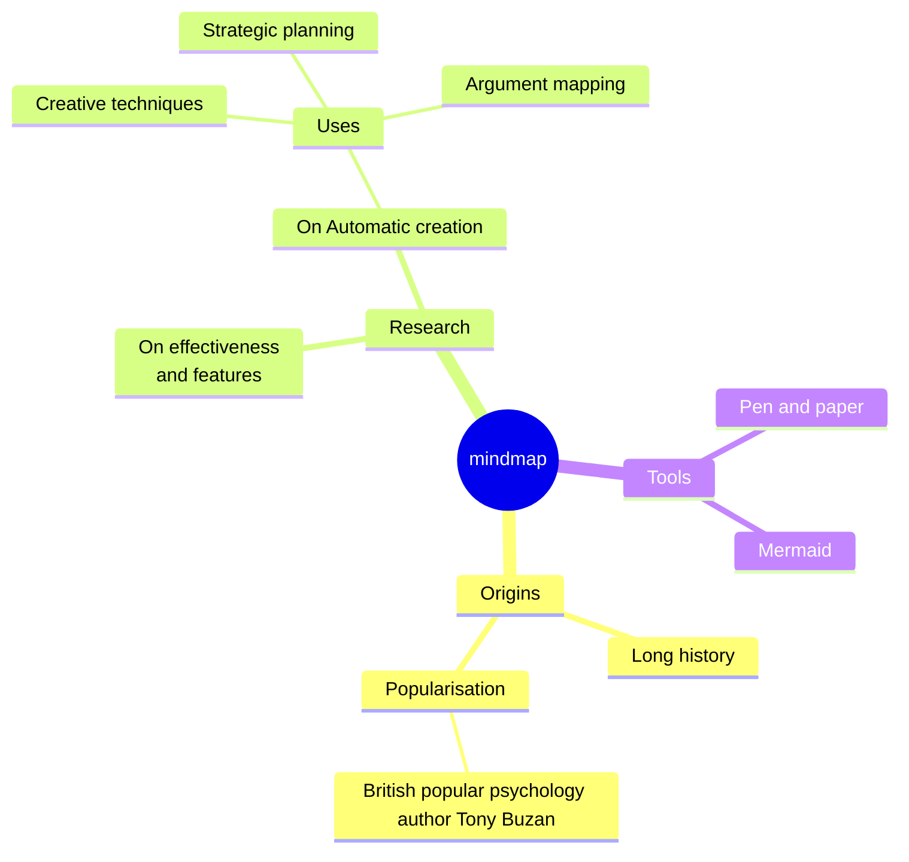
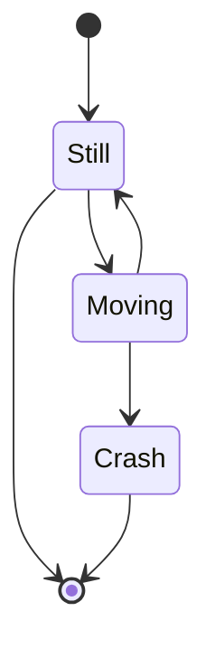
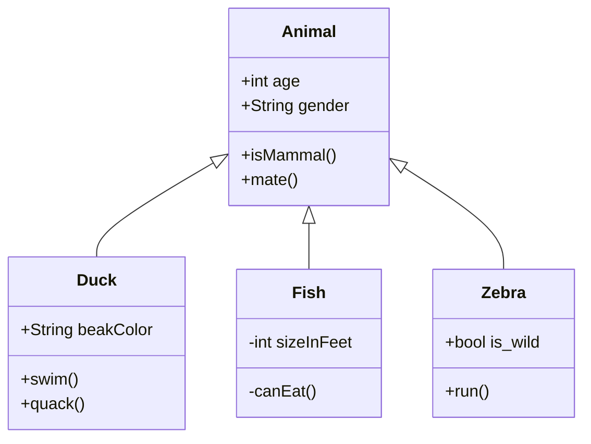
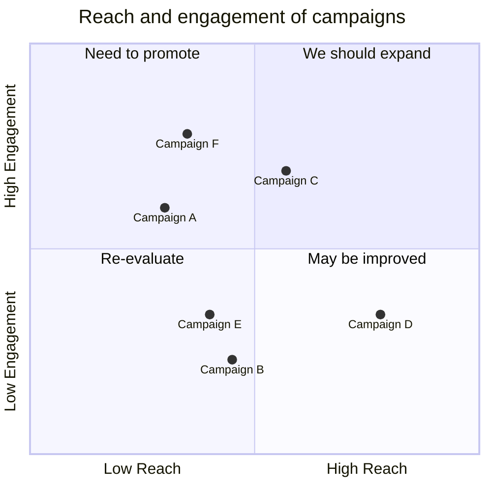
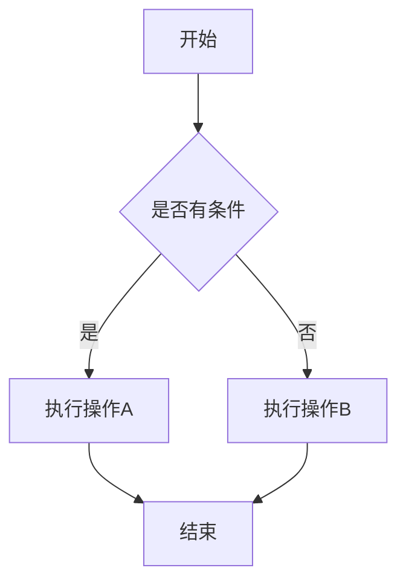
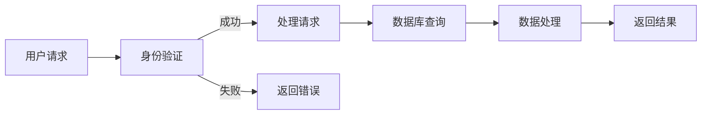
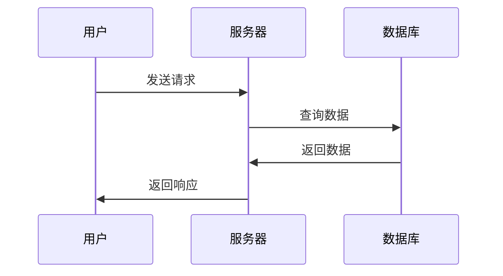

# Mermaid 图表展示

这是一个展示Mermaid图表功能的文章，同时也演示了目录功能。

## 思维导图 (mindmap)

## 状态图 (stateDiagram) 

## 类图 (classDiagram)

## 象限图 (quadrantChart)

## 流程图示例

### 简单流程图

### 复杂流程图

## 时序图示例

## 总结

通过以上示例，我们可以看到Mermaid支持多种类型的图表：
- 思维导图：用于整理思路和概念
- 状态图：用于描述系统状态变化
- 类图：用于展示类之间的关系
- 象限图：用于分析和分类
- 流程图：用于描述业务流程
- 时序图：用于展示交互过程

这些图表都可以通过简单的文本语法来创建，非常适合技术文档和博客文章。