Mermaid 图表展示

这是一个展示Mermaid图表功能的文章，同时也演示了目录功能。

## 思维导图 (mindmap)

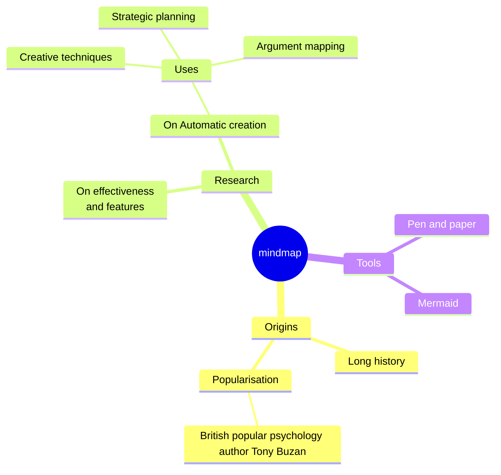

## 状态图 (stateDiagram) 
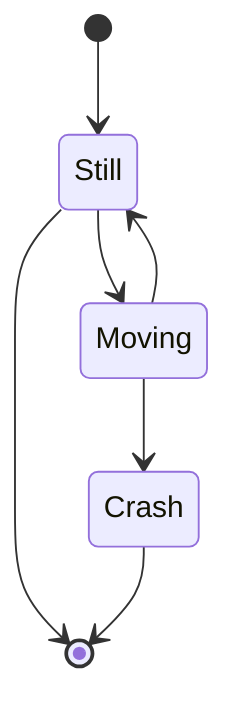

## 类图 (classDiagram)
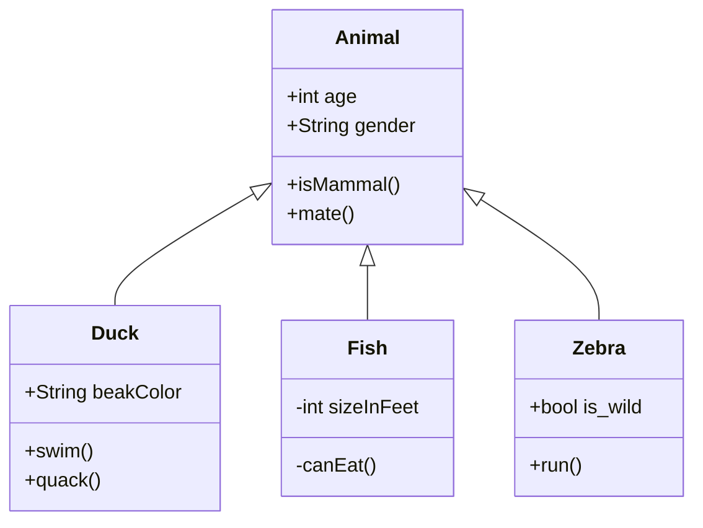

## 象限图 (quadrantChart)

## 流程图示例

## 简单流程图

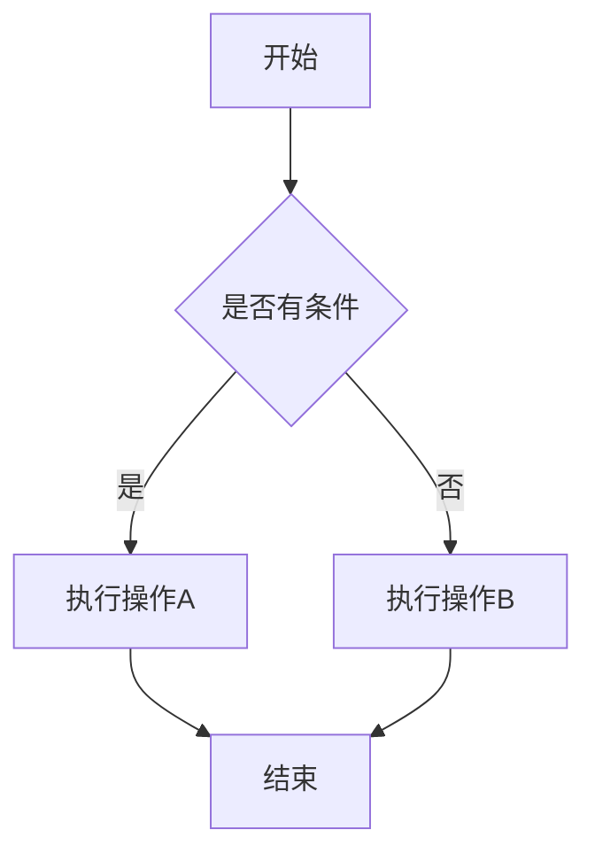

## 复杂流程图

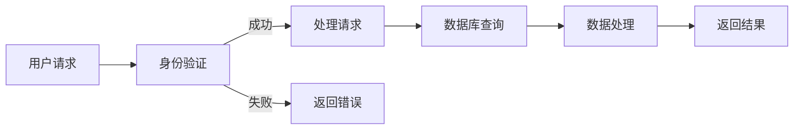
## 甘特图示例
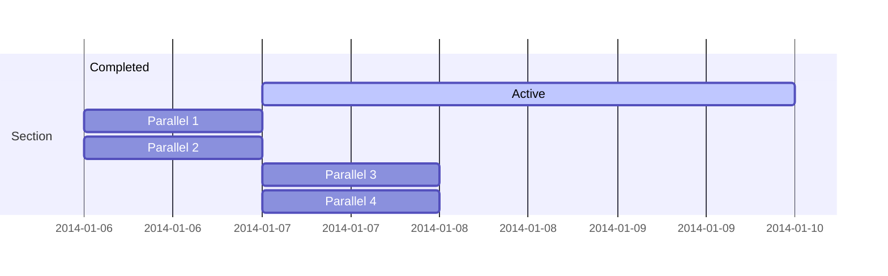

## 时序图示例
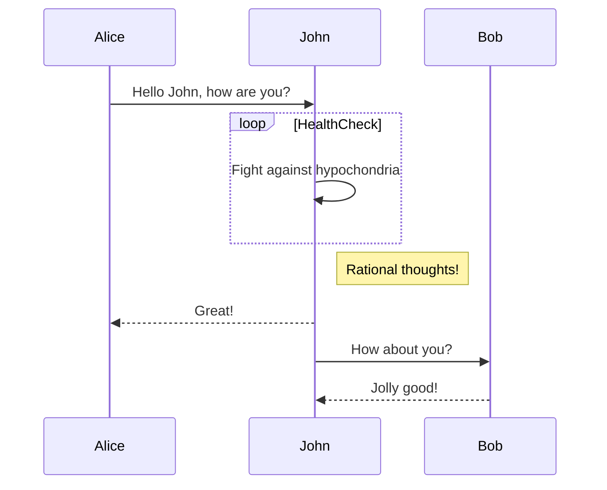

## C4
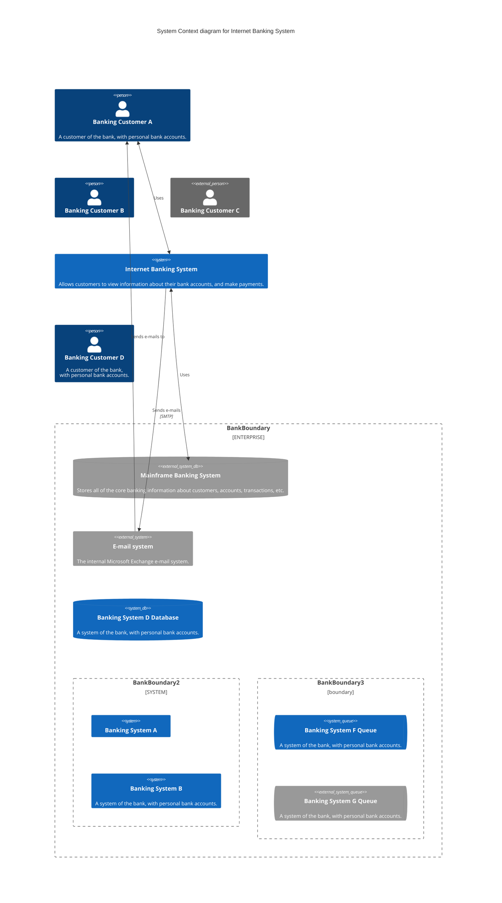
## Journey
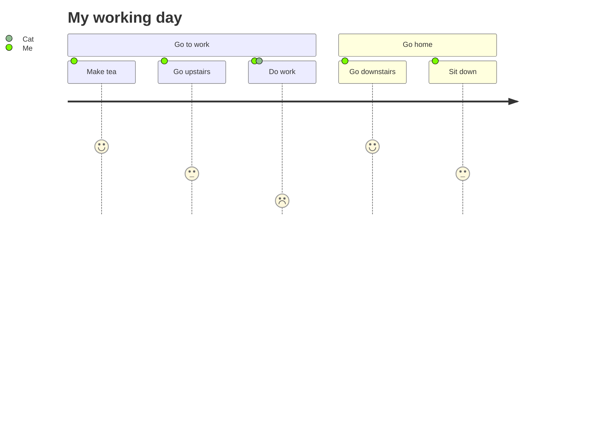

## Bar Chart
```mermaid
gantt
    title Git Issues - days since last update
    dateFormat  X
    axisFormat %s

    section Issue19062
    71   : 0, 71
    section Issue19401
    36   : 0, 36
    section Issue193
    34   : 0, 34
    section Issue7441
    9    : 0, 9
    section Issue1300
    5    : 0, 5
```
## Git Graph
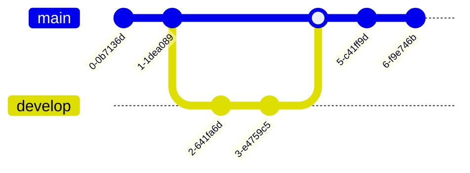

## Pie
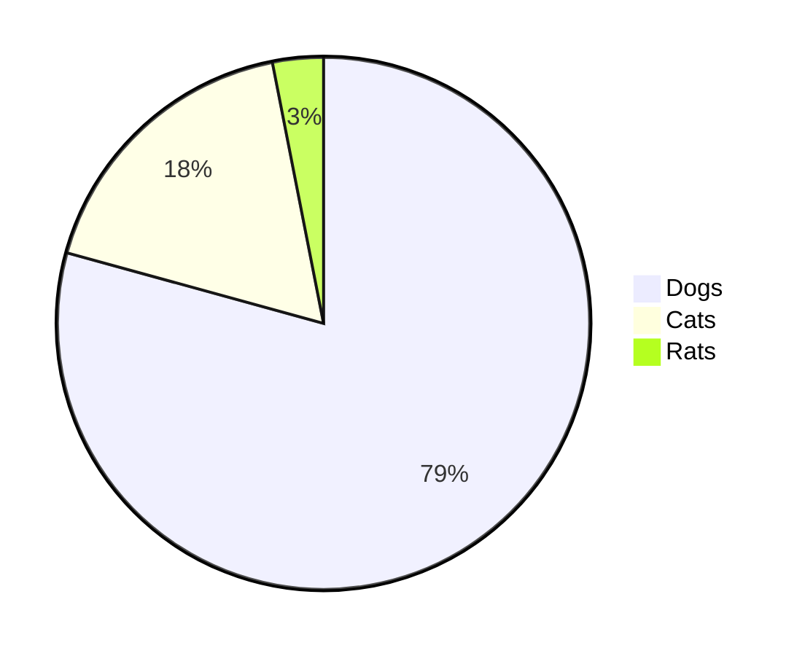

## 总结

通过以上示例，我们可以看到Mermaid支持多种类型的图表：
- 思维导图：用于整理思路和概念
- 状态图：用于描述系统状态变化
- 类图：用于展示类之间的关系
- 象限图：用于分析和分类
- 流程图：用于描述业务流程
- 时序图：用于展示交互过程

这些图表都可以通过简单的文本语法来创建，非常适合技术文档和博客文章。